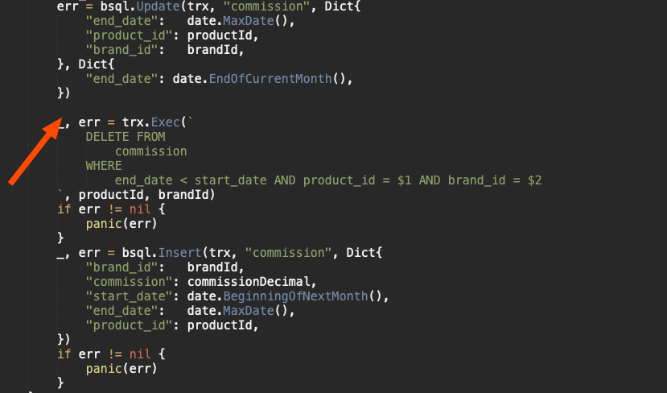
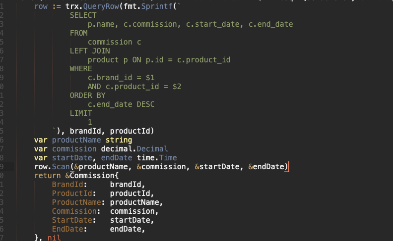
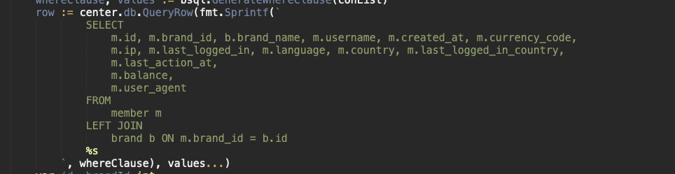
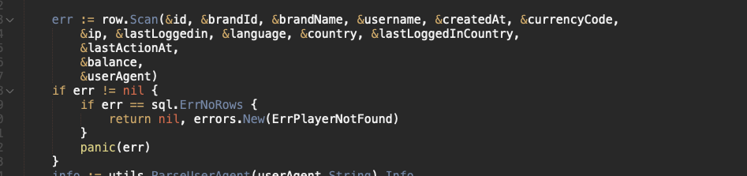
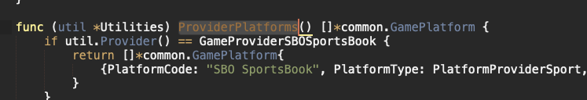
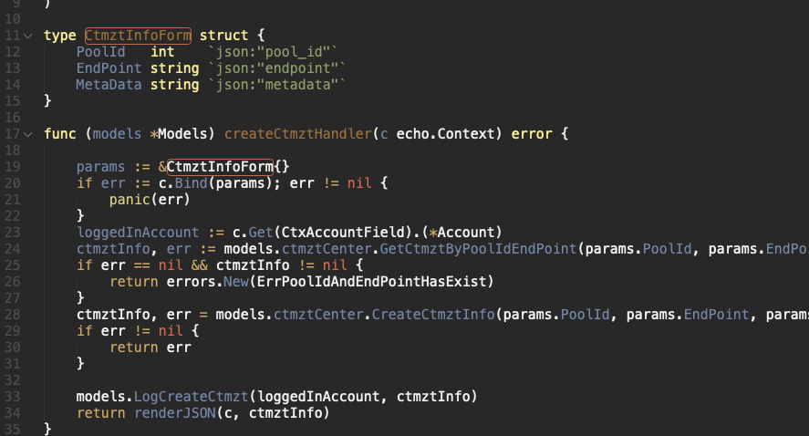
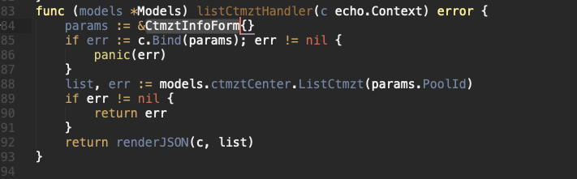

# Code

Do not **eat** error. Example

## Database

Do not use foreign key reference

All string will be `TEXT` type, not `VARCHAR`

All numeric data that does not need to be calculated should be `TEXT` (does not need to be added, substracted, averaged ect)

All numeric data that does need to be calculated should be `BIGINT` for integer and `NUMERIC(22, 4)` for double/float

Timestamp will always have timezone (using `timestamptz`)

Remember to add index

Every changes made to the structure of the database will need migration

When creating new database, have to have `primary key`
* Normally it will be `id BIGSERIAL PRIMARY KEY`
* Please dont use `SERIAL`, or forget to add `PRIMARY KEY`

## Query in code

Should tab, go new line just like this

`LEFT JOIN` clause can stay in 1 line for easier copy paste, but for readability should go new line

Keywords (`SELECT`, `FROM`, `AS` etc) will be uppercased

Long list of variables will go to new line, group each line base on application logic, and when get the value out also stay in same line. Example for the above query

## Naming

If variable or function return a list, slice, it will end with `List` or `s` or `es`

Example:

## Pointer

Will use pointer, always, will not pass by value for struct type object

## Do not reuse struct that are not related just because need a field in it

Example this struct here is for create

Should not do this (reuse the struct for params in list api, because need `PoolId` field)

## API

For API that need validation (username cannot be blank, no special character, or logic validation), API will always have to validate, not just FE
	* Because if only FE validate, anyone can just call the API themself and bypass FE validation