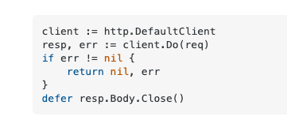
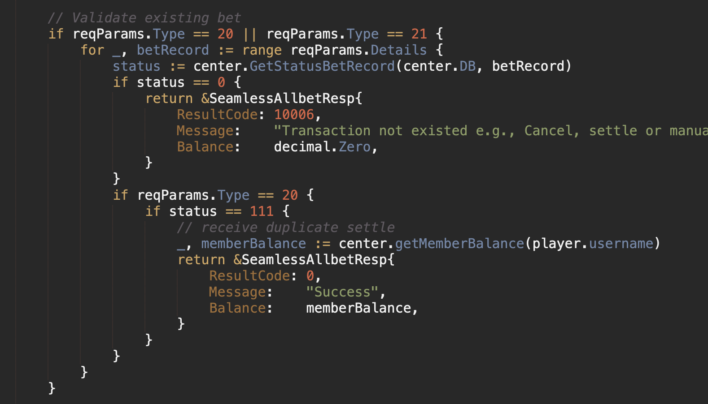
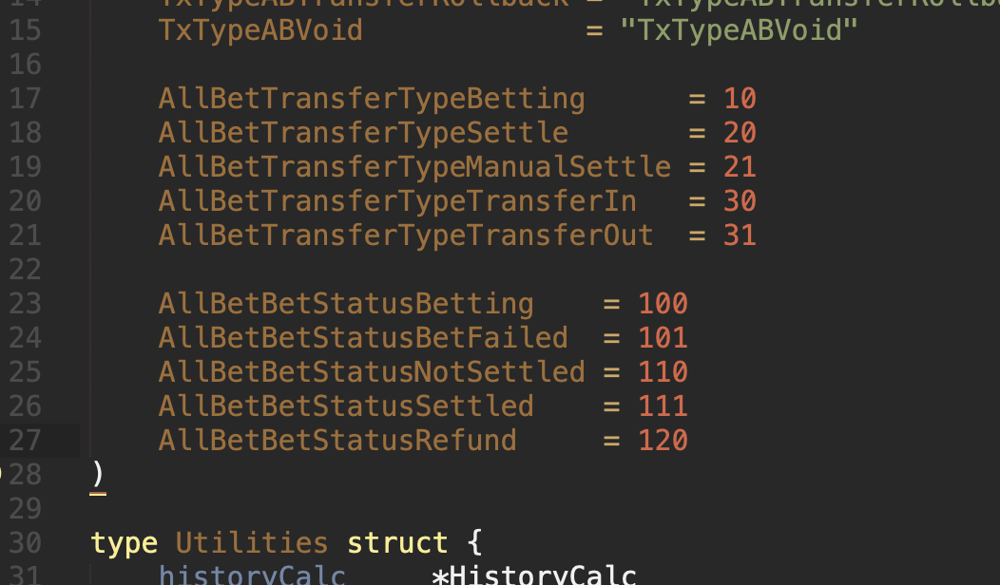
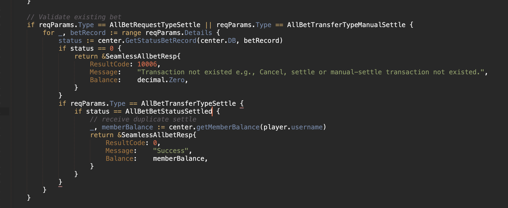

# Code

Do not **eat** error. Example

another example, this will never happen

because if all err "panic inside" then func should not return err

as long as a function return err, it has to be checked

## Database

Do not use foreign key reference

All string will be `TEXT` type, not `VARCHAR`

All numeric data that does not need to be calculated should be `TEXT` (does not need to be added, substracted, averaged ect)

All numeric data that does need to be calculated should be `BIGINT` for integer and `NUMERIC(22, 4)` for double/float

Timestamp will always have timezone (using `timestamptz`)

Remember to add index
* index name format: `<table_name>_<field_name>_index`

Always `defer rows.Close()` after using `db.Query`
* wrap the query code inside `func() {}()` if query code is in a for loop

Think of `db.Query` as a way to get data **only**
* Should not have logic code, func execute code, another query code inside the `for rows.Next()` loop
* Should only have code to get data out of `rows` (`rows.Scan` code) inside `for rows.Next()` loop
* Any logic, func execute code, will stay outside of `for rows.Next()` loop (it should stay in another for loop after `for rows.Next()` loop)

Every changes made to the structure of the database will need migration

When query a big table, limit the query to 1000-3000 rows

If an API request calls more than 50 database queries, rethink the logic flow/talk to manager about performance impact

When creating new database, have to have `primary key`
* Normally it will be `id BIGSERIAL PRIMARY KEY`
* Please dont use `SERIAL`, or forget to add `PRIMARY KEY`

## Query in code

Should tab, go new line just like this

`LEFT JOIN` clause can stay in 1 line for easier copy paste, but for readability should go new line

Keywords (`SELECT`, `FROM`, `AS` etc) will be uppercased

Long list of variables will go to new line, group each line base on application logic, and when get the value out also stay in same line. Example for the above query

## Naming

If variable or function return a list, slice, it will end with `List` or `s` or `es`

Example:

## Pointer

Will use pointer, always, will not pass by value for struct type object

## Do not reuse struct that are not related just because need a field in it

Example this struct here is for create

Should not do this (reuse the struct for params in list api, because need `PoolId` field)

## API

For API that need validation (username cannot be blank, no special character, or logic validation), API will always have to validate, not just FE
	* Because if only FE validate, anyone can just call the API themself and bypass FE validation

## Duplication check

For field, data that need duplication check, will have to check with a regex to prevent special character also

* Normally this will be `username`, `code` bla bla, these always have `a-z0-9` or the like, this will prevent special character

* without special character prevention, data can have extra invisible character that cause 2 same strings to be not equal but display the same

* in this example "douglas" and "douglas" are not equal (https://play.golang.org/p/djhmTffdvvr)

  

# Timezone

For database, use `timestamptz` data type

In Code, should always use `date` package
* will use `date.Now()` instead of `time.Now()` always
* any code about format datetime to string, string to datetime object should use funcs inside `date` package
* if need more func then add new func to `date` package

## HTTP Request

Remember to add `defer resp.Body.Close()` after send request

## Git

Commit message will have to be meaningful

Please dont:

another to do this is squash all commit into 1, then amend the commit message to be meaningful

https://www.internalpointers.com/post/squash-commits-into-one-git

## Int/Number for type

Type should be `string`, a self explain text for that type, eg:

* `promo_win`
* `withdraw`

If integrate 3rd party, and they are using integer/number for type, have to create const for those

Example this is very hard to read, no idea what 20 21 or 111 mean

Updated:

## Error

return when user needs to see the error (input error, validation error)

should not return error when user does not need to see the error (it will be returned to user as `err:internal_server_error`), so most of api call to 3rd party, database query error etc

panic only if need Tech Lead to check (in production, every panic will notify Tech Lead). So another way to think if should panic or not is to ask yourself is this error need check by Tech Lead in production server?

Some panic cases:
* API call to 3rd party
* Most errors from db

If user does not need to see, but also no need to ask Tech Lead to check, then log it to file (using LogSerious)

## HTTP Response when success

Should not response empty or JSON `{}` when success. Can be `{"success": true}` or the like
* This is because sometime when server failure or http problem, empty response can also be sent
