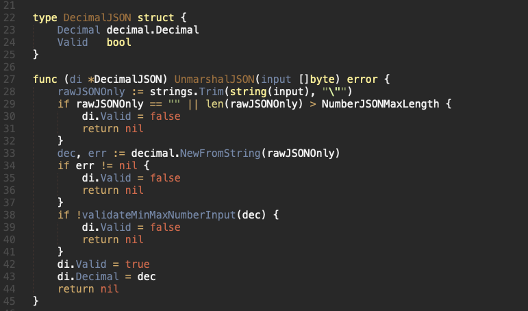

## Validate with a list

Using `found` variable

## Error

return when user needs to see the error (input error, validation error)

should not return error when user does not need to see the error (it will be returned to user as `err:internal_server_error`), so most of api call to 3rd party, database query error etc

panic only if need Tech Lead to check (in production, every panic will notify Tech Lead). So another way to think if should panic or not is to ask yourself is this error need check by Tech Lead in production server?

Some panic cases:
* API call to 3rd party
* Most errors from db

If user does not need to see, but also no need to ask Tech Lead to check, then log it to file (using LogSerious)

## JSON Field Validation

## Database Execution

To execute database: insert, update, upsert. In the source will have the functions to support that.

If these functions does not support the case your are facing let dicuss with TeachLead.

Insert:

Update:

Upsert:

## Select/Query functions.
If you are facing the case you need to Select/Queries in a table with the same columns but with different conditions. To do this you need to define a original function with input a **Condition List** then you define a related function (name, conditons) base on its logically.

Example:

- Write a original function:

- Define related functions with the original one.

## Center Format.

If a feature need to create a new package, we must to add a object center at this package and all the functions/features/logics  will be called through this object.

Example: We have a role feature and it needs to be defined in a separate package.

Step 1: we create a new package and define an object center (RoleCenter) in this package 

Step 2: Define functions/feature/logic in role package and attached to RoleCenter

Step 3: Go back to the models and init Role Center at there

Step 4: Call the functions in object center (Role Center) base on the logic if needed.

### Identify the relationship between multiple centers: 
For some cases you create object center  and this center maybe need to call features/logics from another centers.
To do this we need to indentify the relationship between the centers firstly (discuss with TeachLead to make sure this).

#### Center contains the others.
Example: We have SubAccountCenter And RoleCenter, we can realize SubAccountCenter contains RoleCenter for sure to define that we have to do:

Step1: Define a RoleCenter like the step at example above.

Step 2: Define a SubCenter constains RoleCenters

Step3: Init the SubCenter at models

For some reasons/logics roleCenter need to action back to subCenter we shoudn’t define subCenter at roleCenter. If you do that we will get the error “import cycle not allow”

Example:

To do this case: 

Step 1: Add a attributes (roleDelegate) into subCenter

Step2: Comeback to models and define a function RoleCallBackHandler

Step3: At the subCenter you just call RoleCallbackHandler if you need some update from role.

#### Centers are same level:
For the same level center we call define separately at sample above and the communication between these centers will be through by models.

Example:

### Query in center

Each table query must be executed at the relevant center.

Example: table role have to query in role center only.

## Display for FE

If we have an struct with mulitple attributes inside and we do not need to display all of these attributes at FE, we can create another struct with the related attributes to display at FE.

Example: we have a struct like this, it has multiple attributes inside and we no need to display all of them.

Create an another struct (format: {main struct name}DisplayForFE) and define the attributes need to show.

And the displayForFE struct base on the attributes from main struct.

